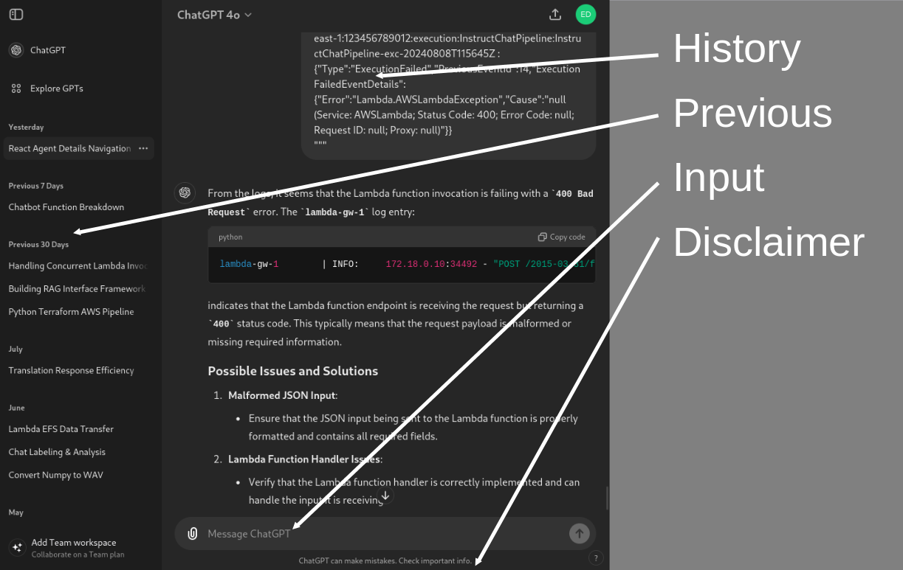
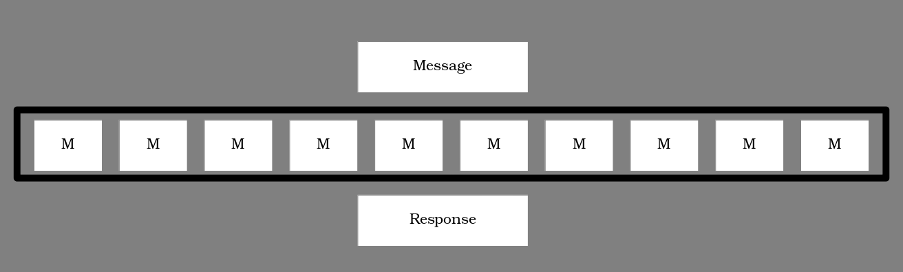

# How Does ChatGPT Work?

As AI continues to reshape technology, understanding the components of AI products becomes essential.
When we breakdown these products we can understand the various engineering costs and risks associated with them.

Recently, I delivered a talk dissecting ChatGPT, breaking down its components, processing methods, and supporting infrastructure.
In this article, I'll breakdown the ChatGPT product from OpenAI.

+ __Section 1__ describes the user interface.
+ __Section 2__ outlines the model, how they are trained, and the specific advancments which made the chat approach viable.
+ __Section 3__ covers infrastructure which handles the deployment of this model to serve users.

Whether you're a developer, a business professional exploring AI capabilities, or simply curious about how ChatGPT generates responses, this breakdown offers insight into the composition.


## User Interface (UI)

The UI is the interface between users and the AI component.
Its layout resembles familiar chat applications like WhatsApp, the classic MSN Messenger, or even older applications like ICQ.
The interface serves as a straightforward tool for input and output: it is not overly complex and acts as a showcase for the API which drives the system.



The above image captures the main elements of the UI:
+ Chat history, a list of messages sent between the user and the model
+ Previous chats, a list of historical chats,
+ Input area: where the user can enter text, upload files, etc.
+ Disclaimer: a note indicating the output should be reviewed for accuracy -- which seems common to all LLM applications!

In this interface, the user types text into the input panel; that text is submitted to the model via an __API__. The response from the model is added to the chat history, which the user can read and browse at leisure.

Notably, several things do not occur within the UI:

+ No pre-processing of input: When you type a message, it's submitted directly to the model without any preliminary changes or analysis.
+ No continuous polling or uploading as you type: The response from the model is streamed back as an event, mirroring standard API call behavior.

This form of user interface is designed to be lightweight and user-friendly, demonstrating the API's flexibility for integration into other applications.


## The Model

In machine learning parlance, a __model__ consists of code, which describes the archicture of the model, and a file of parameters which adjusts how the code behaves. These files are often refered to as **weights** or **parameters** of the model, and can be many gigabytes in size. In the case of ChatGPT, they are not publicly available.

Large-language models are typically __Transformer__ architectures: highly effective in processing sequential data.
Text-based models are typically trained to predict the next word in a sentence.
For example: given the input "The cat sat on the " the model might predict "mat" as the most probable next word; "hat", "car" and so on are technically wrong, but still sensible, so might be less likely, and an emoji or poor grammar (e.g, "solitude") would be least likely.

In this way the model is trained to associate sequences of words, and, due to the large size of these models, begins to learn concepts in the sentences, such as grammar, appropriate responses, and so on.

In a more technical form:
+ The model estimates the __Conditional Probability__ of the next word given the previous words, i.e., What is the likelihood of x given y -- in mathematical notation this is `P(x|y)`.
+ For example: `P(the|on|sat|cat|the)=P(mat)=0.9`

These concepts are foundational in language modeling and are related to statistical methods in machine learning. Key phrases for you to follow up would be: [Bayes Theorem](https://en.wikipedia.org/wiki/Bayes%27_theorem), the [Expectation Maximisation algorithm](https://en.wikipedia.org/wiki/Expectation%E2%80%93maximization_algorithm), and also the [Viterbi Algorithm](https://en.wikipedia.org/wiki/Viterbi_algorithm) (an old school approach) if you are interested in the background! Also checkout Stephan Wolframs article [What is ChatGPT doing?](https://writings.stephenwolfram.com/2023/02/what-is-chatgpt-doing-and-why-does-it-work/) which looks at the mathematical principles of these models.

### Big Data

Interestingly, due to the archecture of these models, they are not so prone to __over-fitting__, which was a significant bottleneck to using massive amounts of data to train massive models in the past -- in simple terms: the model would simply memorize the data.

Additionally, these models are capable of being trained on any sequential data: Genetic sequences, music, translation, machine code, etc. Providing the data can be sourced and formatted appropriately.

The ability of Transformers to accept massive amounts of data led to rapid experiementation and discoveries around their ability to learn and relate concepts which are difficult for humans to discover. How this conceptual data is represented in the model is an interesting area of research. For introduction I would recommend:
+ [Transformer Circuits](https://transformer-circuits.pub/2021/framework)
+ [Neal Nanda on Machine Learning StreetTalk](https://www.youtube.com/watch?v=cVBGjhN4-1g) discussing a whole host of insights in this area.

### Instruct Models

To make these models more practical for real-world applications, they are __fine-tuned__. The most relevant advancement is the development of __Instruct__ model.

An Instruct model is a large language model fine-tuned on datasets that include instructions and desired responses. This training allows the model to better understand and follow user prompts, generating more useful and context-aware outputs. The models are still "predicting", but "the next word" is now "the next response", and can include semantic concepts such as answering questions, labelling topics, following patterns of response, and so on.

```
[
    {"role": "system", "content": "You are a pirate chatbot who always responds in pirate speak!"},

    {"role": "user", "content": "Who are you?"},

    {"role": "assistant", "content": "Arhhh I be the jolly roger so I be!!"},

    {"role": "user", "content": "Not sure you get this pirate speak matey!"},

    {"role": "assistant", "content": "Argh, walk the bleedin plank!"},
]
```

The above is an except of structured chat data which alters the way a Large-Language model behaves.

The use of __instruct fine-tuning__ has been a major innovation in machine learning. Typically, all new Large Language Models are now expected to have this behaviour applied or available as a variant.


## Infrastructure

Given the UI and the Model, the remaning challenge is coupling the Model to requests from the UI, in a scalable and performant manner.

The infrastructure has three main components:
+ __API__: providing access to the model's functionality and a typical tech problem.
+ __Database__: stores user data and conversation history, a typical tech problem.
+ __GPU Cluster__: the hardware on which the model is executed. This is the novel challenge in the product space.

A GPU cluster is simply a large number of machines with GPU hardware attached. Having built a few of these over the years, they are relatively simple to put together, however, managing such clusters has significant challenges:

Hardware challenges:
+ overheating,
+ memory issues,
+ driver issues,
+ update cycle,
+ localisation of data to device

Administration of these clusters is challenging indeed, and the main cost for building and running these products.

However, once the model execution environment are established, scaling to meet increased demand becomes more managable.



In the above diagram, we have the main flow of data in these clusters. At the top is the message to be processed, in the middle is the large cluster of models (__M__) which host and run the model on the hardware, and finally, at the bottom is the response of the model.

Crucially, there is no state to be stored. The model and the message contain all the information needed to create the response, so there are no interactions with external systems.

To handle more users or messages, we can scale horizontally by adding more instances of M. If we update the model, we deploy the new version across the cluster, while the underlying hardware and infrastructure remain largely the same.

Model deployment is an almost an ideal decentrailised, distributed system where the model __is__ the backend.

### Metrics
Key metrics guide performance improvements:

+ Tokens per second: Measures how quickly the model processes user input.
+ Tokens per dollar: Assess the cost efficiency of responses.
+ Tokens per joule: Assess the energy efficiency of responses.
+ Response time: Essential for a smooth user experience.

These metrics help maintain system efficiency and inform future directions, such as:

+ Model optimization: Techniques like model distillation to reduce size while retaining performance.
+ Custom hardware development: Designing hardware optimized for specific AI workloads.
+ Task specialization: Enhancing the model's capabilities in areas like image understanding or domain-specific knowledge.

# Conclusion

In summary, the ChatGPT product operates through the integration of three key components:

+ A User Interface which allows easy input of queries.
+ A Model that processes input and generates intelligent, context-aware responses.
+ An Infrastructure that ensures smooth operation at scale, efficiently handling millions of queries.

Each has a specific, measureable quanities which reflect value and cost to the product as a whole.

If you would like to discuss a breakdown of similar products, please contact us from our [main page](https://www.bayis.co.uk/#contact-us).
